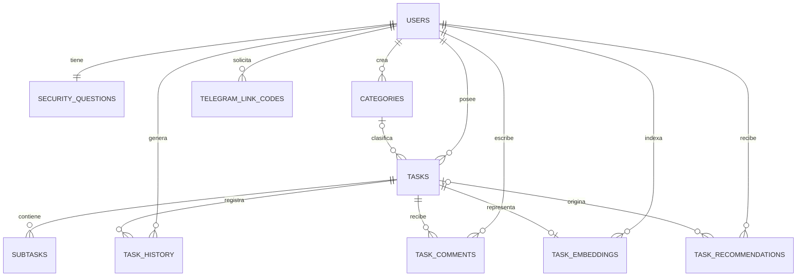

# Diseño PostgreSQL — Bloque 2

Estado: diseño implementado y validado localmente. La aplicación todavía usa
SQLite como motor de ejecución; el cambio de runtime y la transferencia de datos
pertenecen al Bloque 4.

## Decisión técnica

- PostgreSQL 16 será la base objetivo.
- Drizzle ORM define el esquema y la capa inicial de repositorios.
- Drizzle Kit genera migraciones SQL versionadas.
- `pg` será el controlador del servidor.
- PGlite permite validar el SQL de PostgreSQL sin instalar un servicio local.
- Docker Compose queda disponible como alternativa equivalente al flujo de
  RemesaFam para integrantes con Docker o WSL.

PGlite se usa únicamente para pruebas de esquema. No reemplaza una instancia
PostgreSQL de staging ni valida red, credenciales, persistencia del volumen,
copias de seguridad o concurrencia real.

## Límites de este bloque

Este bloque no:

- importa datos desde SQLite;
- cambia las rutas de la aplicación para que usen PostgreSQL;
- elimina el esquema SQLite seguro;
- despliega en Netcup;
- presupone que una base antigua puede migrarse sin inventario y conteos.

## Diagrama de relaciones



## Diccionario de datos

| Tabla | Finalidad | Clave y relaciones | Reglas relevantes |
|---|---|---|---|
| `users` | Identidad, sesión e integraciones | PK `id` | Correo único sin distinguir mayúsculas; Telegram único cuando existe; tokens Google solo cifrados |
| `security_questions` | Recuperación local | FK única a `users`, borrado en cascada | Preguntas distintas, índices válidos e intentos no negativos |
| `categories` | Clasificación personal | FK a `users`, cascada | Nombre único por usuario sin distinguir mayúsculas; color hexadecimal |
| `tasks` | Unidad principal de trabajo | FK a `users`; categoría con `SET NULL` | Fecha límite `DATE`; recordatorio `TIMESTAMPTZ`; estado y booleano completado coherentes |
| `subtasks` | Pasos de una tarea | FK a `tasks`, cascada | Texto obligatorio y booleano nativo |
| `task_history` | Auditoría de cambios | FK a tarea y usuario, cascada | `changed_at` conserva zona horaria |
| `task_comments` | Conversación de una tarea | FK a tarea y usuario, cascada | Ownership se comprueba mediante la tarea; límite de 4000 caracteres |
| `task_embeddings` | Vector semántico y metadatos | FK única a tarea y FK a usuario | JSONB debe ser arreglo y coincidir con `dimension` |
| `task_recommendations` | Respuestas generadas por IA | FK opcional a tarea y FK a usuario | Fuente tipada: z.ai, Ollama, historial o reglas |
| `telegram_link_codes` | Vinculación temporal de Telegram | FK a usuario, cascada | Hash HMAC único; expiración y consumo con zona horaria |

## Transformaciones desde SQLite

| SQLite actual | PostgreSQL objetivo | Motivo |
|---|---|---|
| Enteros `0/1` | `boolean` | Evita estados ambiguos |
| Fecha límite como texto | `date` | Representa un día, no un instante |
| Recordatorios y auditoría numéricos/texto | `timestamp with time zone` | Conserva el instante real |
| IDs autoincrementales | `generated always as identity` | Mecanismo nativo y explícito |
| Correo `COLLATE NOCASE` | Índice único sobre `lower(email)` | Unicidad consistente |
| Recomendaciones mezcladas con subtareas | `task_recommendations` | No confunde sugerencias con trabajo aceptado |
| Tokens Google en texto | AES-256-GCM con prefijo `enc:v1:` | Un volcado de base no revela credenciales reutilizables |

Los embeddings permanecen como JSONB temporalmente. No se activa `pgvector`
hasta fijar un único modelo y dimensión; hacerlo antes podría crear una
restricción incompatible con datos generados por proveedores distintos.

## Repositorios y ownership

`src/db/postgres/repositories.js` contiene la primera capa compartida para
usuarios, tareas y comentarios. Las consultas de tareas y comentarios incluyen
el identificador del propietario, de modo que no dependen de comprobar ownership
después de leer la fila.

El acceso duplicado `src/lib/db.bot.cjs` fue retirado. Mientras SQLite siga siendo
el runtime, el bot y la web comparten `src/lib/db.js`; el consumo de códigos
temporales vive en `src/lib/telegramLink.js`.

## Comandos

### Validación sin Docker

```bash
npm ci
npm run db:pg:generate
npm run db:pg:verify
```

`db:pg:verify` crea una base PostgreSQL embebida vacía, aplica la migración dos
veces y comprueba que el registro de migraciones no se duplique.

### PostgreSQL 16 con Docker o WSL

```bash
docker compose -f compose.postgres.yml up -d
docker exec novatareas-db-dev pg_isready -U novatareas -d novatareas
npm run db:pg:migrate
```

Usar `127.0.0.1:5434`, no `localhost`, para evitar diferencias de resolución o
redirección entre Windows y WSL. La base solo se publica en loopback.

Para detener el servicio sin borrar sus datos:

```bash
docker compose -f compose.postgres.yml stop
```

No ejecutar `down -v` salvo que se haya confirmado que el volumen es descartable,
porque elimina la base local.

## Cifrado de Google Calendar

`TOKEN_ENCRYPTION_KEY` debe contener exactamente 32 bytes codificados en
base64url. Los callbacks cifran access y refresh tokens antes de persistirlos y
los descifran únicamente al construir el cliente de Google. La base PostgreSQL
rechaza valores que no tengan el prefijo versionado.

La clave no debe compartirse entre local, staging y demo. Perderla impide
recuperar los tokens; rotarla requerirá volver a autorizar las cuentas o una
migración de cifrado controlada.

Los tokens heredados en texto plano no se copiarán a PostgreSQL. Si alguna base
ficticia los contiene, el importador del Bloque 4 debe descartarlos y exigir una
nueva autorización de Google.

## Evidencia y pendientes

Validado en este bloque:

- migración generada para las diez tablas;
- aplicación idempotente en PostgreSQL embebido;
- tipos `DATE` y `TIMESTAMPTZ`;
- restricciones de correo, tokens y estado completado;
- ownership en repositorios;
- cifrado autenticado y detección de alteraciones;
- ausencia de vulnerabilidades conocidas en `npm audit`.

Pendiente para el Bloque 4:

- levantar una instancia PostgreSQL externa y probar conexión/persistencia;
- implementar todos los repositorios de escritura;
- sustituir expresiones específicas de SQLite;
- exportar, transformar, importar y comparar los datos;
- ejecutar pruebas funcionales completas con PostgreSQL como runtime;
- documentar y ensayar rollback con una copia ficticia.

## Referencias oficiales

- [Drizzle Kit](https://orm.drizzle.team/docs/kit-overview)
- [Migraciones con Drizzle](https://orm.drizzle.team/docs/migrations)
- [PGlite](https://pglite.dev/docs/)
- [Tipos de fecha y hora de PostgreSQL](https://www.postgresql.org/docs/current/datatype-datetime.html)
